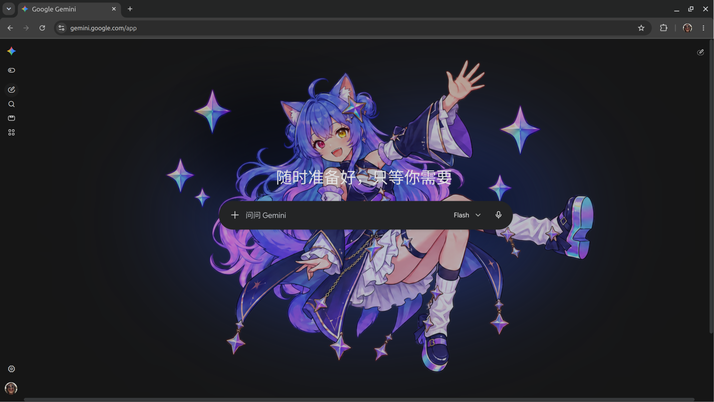
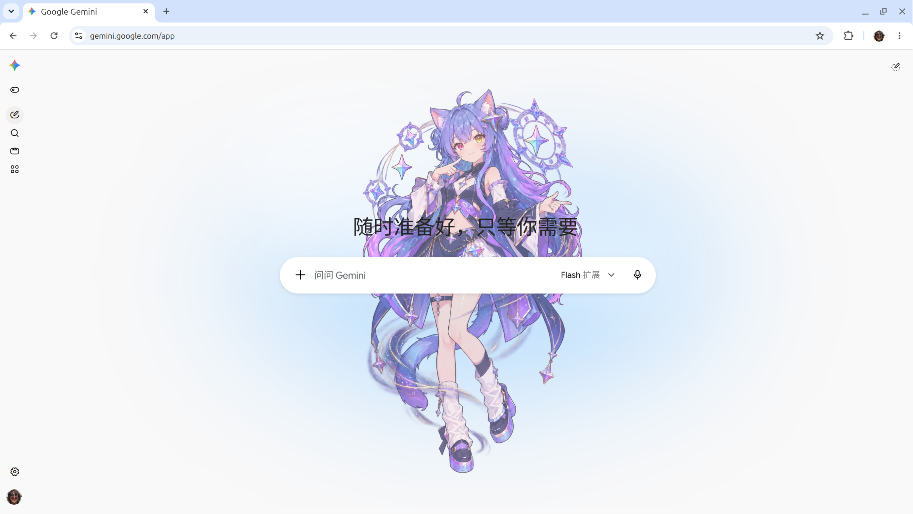

# ReasoningWaifu

[English](README.md) | 简体中文

为 AI 聊天网页添加随模型与思考模式切换的拟人角色，让聊天界面多一点陪伴感。

## 使用方法

1. [下载扩展安装包（v0.1.0）](https://github.com/Idea1i5t/ReasoningWaifu/releases/download/v0.1.0/ReasoningWaifu-v0.1.0.zip)。
2. 将安装包解压到本地文件夹。
3. 在 Chrome 地址栏输入 `chrome://extensions`，或在设置中点击扩展，打开扩展管理页面。
4. 开启右上角的 **开发者模式**。
5. 点击 **加载已解压的扩展程序**，选择解压后包含 `manifest.json` 的扩展文件夹。
6. 打开或刷新支持的聊天网页，切换模型与思考模式即可查看效果。

## 实现方式

基于 Chrome 扩展，通过内容脚本读取所支持页面上的模型与思考模式，监听页面变化并切换对应的本地角色图片。欢迎页和聊天页使用独立布局，图片不会拦截鼠标操作；无法识别状态时显示默认角色。

## 支持范围

- 当前支持：桌面 Chrome 上的 [Gemini](https://gemini.google.com/app)。
- 后续计划：加入 ChatGPT 和 DeepSeek，其他平台暂未确定。
- 暂未适配移动端；网站改版或模型选项变化可能影响识别。

## 致谢

- 角色形象设计来源于 B 站 UP 主 **@ZipZipPipe**，已获原作者同意用于本开源网页插件并注明出处。项目中使用的图片由项目作者基于原设计自行生成和处理。
- 开发与构建使用 [TypeScript](https://www.typescriptlang.org/)、[esbuild](https://esbuild.github.io/) 及 [DefinitelyTyped](https://github.com/DefinitelyTyped/DefinitelyTyped) 提供的 Chrome API 类型声明。
